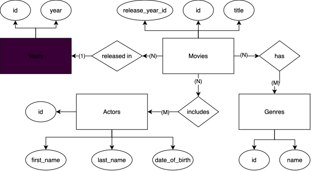

# Java Spring Project - API Movies

## Description
> A simple REST API application to manage movies with any database connected. It was created at Java Full-Stack Developer Bootcamp of Factoria F5 company. 

### Stack
> - Java 21
> - Maven
> - Spring Framework
> - H2 In-Memory Database
> - JPA & Hybernate
> - Junit Jupiter
> - Jacoco
> - Hamcrest
> - Mockito

### Used patterns
> - REST API
> - CRUD
> - MVC pattern
> - DTOs/mappers
> - DIP (Dependency Inversion Pattern)
> - DRY

## API reference

### Home

| Method | Endpoint | Description     |
|--------|----------|-----------------|
| GET    | `/`      | Welcome message |
        
### Movies

| Method | Endpoint                                 | Description            |
|--------|------------------------------------------|------------------------|
| GET    | `/api/v1/movies`                         | Get all movies         |
| GET    | `/api/v1/movies/{id}`                    | Get movie by id        |
| GET    | `/api/v1/movies/search?title={input}`    | Search movies by title |
| POST   | `/api/v1/movies`                         | Store new movie        |
| PUT    | `/api/v1/movies/{id}`                    | Modify existing movie  |
| DELETE | `/api/v1/movies/{id}`                    | Delete existing movie  |
        
### Genres

| Method | Endpoint                                 | Description            |
|--------|------------------------------------------|------------------------|
| GET    | `/api/v1/genres`                         | Get all movies         |
| GET    | `/api/v1/genres/{id}`                    | Get movie by id        |
| GET    | `/api/v1/genres/search?genreName={input}`| Search genres by query |

### Actors

| Method | Endpoint                                 | Description              |
|--------|------------------------------------------|--------------------------|
| GET    | `/api/v1/actors`                         | Get all actors           |
| GET    | `/api/v1/actors/{id}`                    | Get actor by id          |
| GET    | `/api/v1/actors/search?fullname={input}` | Search actor by fullname |

### Release years

| Method | Endpoint                                 | Description              |
|--------|------------------------------------------|--------------------------|
| GET    | `/api/v1/years`                          | Get all years            |
| GET    | `/api/v1/years/{year}`                   | Get exact year           |


## Some API details

### `GET /api/v1/movies/9`

**Response 200:**
```json 
{
    "id": 9,
    "title": "Spider-Man: Brand New Day",
    "release_year": 2026,
    "genres": [
        "Action",
        "Adventure",
        "Sci-Fi",
        "Fantasy"
    ],
    "actors": [
        "Tom Holland",
        "Zendaya "
    ]
}
```


### `GET /api/v1/genres/search?genreName=A`

**Query params:**
| Param     | Type   | Required | Описание                                       |
|-----------|--------|----------|------------------------------------------------|
| genreName | string | yes      | A word that can be the beginning of genre name |

**Response 200:**
```json
[
    {
        "id": 1,
        "name": "Action",
        "movies": [
            {
                "id": 1,
                "title": "Spider-Man",
                "release_year": 2002,
                "genres": [
                    "Action",
                    "Adventure",
                    "Sci-Fi"
                ],
                "actors": [
                    "Tobey Maguire",
                    "Kirsten Dunst",
                    "James Franco",
                    "Willem Dafoe"
                ]
            },
            ...
        ]
    },
    {
        "id": 2,
        "name": "Adventure",
        "movies": [...
        ]
    }
]
```

### `GET /api/v1/actors/search?fullname=Tobey Maguire`

**Query params:**
| Param     | Type   | Required | Описание                       |
|-----------|--------|----------|--------------------------------|
| fullname  | string | yes      | A correct fullname of an actor |

**Response 200:**
```json
{
    "id": 1,
    "fullname": "Tobey Maguire",
    "movies": [
        {
            "id": 1,
            "title": "Spider-Man",
            "release_year": 2002,
            "genres": [
                "Action",
                "Adventure",
                "Sci-Fi"
            ],
            "actors": [
                "Tobey Maguire",
                "Kirsten Dunst",
                "James Franco",
                "Willem Dafoe"
            ]
        },
        ...
    ]
}
```


### `POST /api/v1/movies`

**Request body:**
```json
{
    "title": "Avengers: Doomnight",
    "release_year": 2027, 
    "genres": [
        "Action",
        "Adventure",
        "Sci-Fi"
    ], 
    "actors": [
        "Robert Downey Jr.",
        "Pedro Pascal",
        "Chris Hemsworth",
        "John Travolta"
    ] 
}
```

**Response 201:**
```json
{
    "id": 10,
    "title": "Avengers: Doomnight",
    "release_year": 2027,
    "genres": [
        "Action",
        "Adventure",
        "Sci-Fi"
    ],
    "actors": [
        "Robert Downey Jr.",
        "Pedro Pascal",
        "Chris Hemsworth",
        "John Travolta"
    ]
}
```


## Installation steps: 

1. Clone the GitHub project:

```bash
git clone https://github.com/danielmuntyanu/java-spring-api-movies
```

2. Go to project directory and compile project to check everything is good:

```bash
cd java-spring-api-movies;
mvn compile
```


3. Run the unit tests to make sure everything works as expected:

```bash
mvn test
```

4. Run the application:

```bash
mvn exec:java
```

<br> 

## Diagrams

### ER-Diagram de Chen (Entity Relationship)


### Crow's Foot Diagram


## Authors
- [Danyil Muntianu](https://github.com/danielmuntyanu)